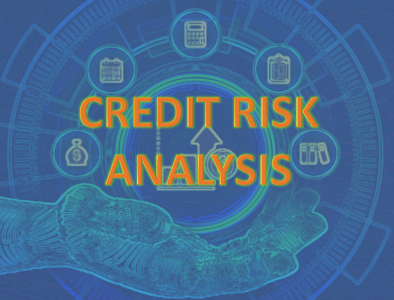
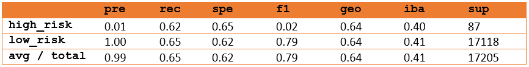
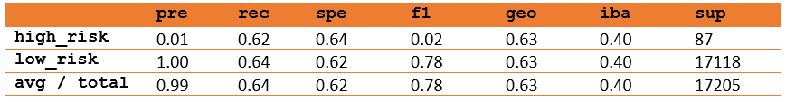

 

# Credit_Risk_Analysis

# Overview
Analyze credit card risk by training six Machine Learning models and evaluating each outcome.

# Results
* All models showed poor precision scores when predicting high risk credit applications.
* All models showed >= 0.60 recall scores in predicting high risk credit applications.
* Easy Ensemble AdaBoost Classifier topped the list predicting 0.91 high risk credit applications.
## Random Oversampling

 Model Accuracy = 0.637
 
  
 
## SMOTE Oversampling
Model Accuracy = 0.630

  
 
 

